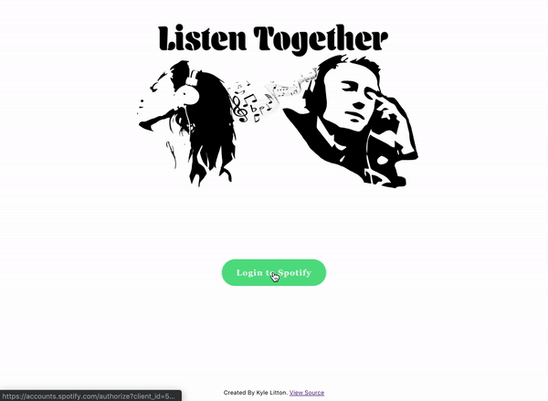

# Listen Together

## About
Sign in with your Spotify premium account and create a group that your friends can join. Any user who joins the group will have their music synced with the music playing on the group creator's Spotify account.

Try it out! -> https://kyle-litton.github.io/ListenTogether/

API repo found here -> https://github.com/kyle-litton/ListenTogetherAPI

## Built With
* React
* Redux
* Spring Boot
* Node.js
* Mongo DB